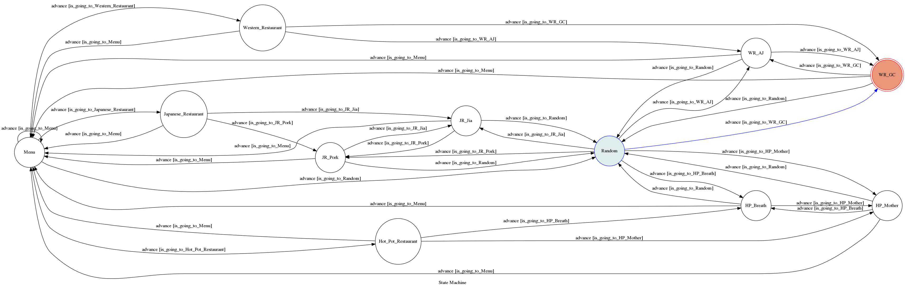

# Restaurant Selection 
## Introduction 
This is a line bot that will help tou to select a restaurant for lunch and dinner 

## Finite State Machine 

## Main Function 
The restaurants is divided into three catagories

Each catagories has two recommended restaurants 

When a restaurant is selected , three message is sent
1)The first is the restaurant's menu

2)The second message sent is the Office hour of the restaurant 

3)The third one is the next operation can be made

### If the user didn't know which restaurant to select , the user can select random. The bot will randomly select a reataurant 
